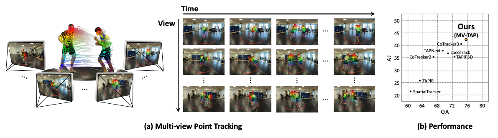

<div align="center">
<h1>MV-TAP: Tracking Any Point in Multi-View Videos</h1>

[**Jahyeok Koo**](https://scholar.google.com/citations?user=1Vl37dcAAAAJ&hl=ko)<sup>\*</sup> · [**Inès Hyeonsu Kim**](https://ines-hyeonsu-kim.github.io)<sup>\*</sup> · [**Mungyeom Kim**](https://github.com/mungyeom011) · [**Junghyun Park**](https://junghyun-james-park.github.io/)<br>[**Seohyeon Park**](https://eainx.github.io/) · [**Jaeyeong Kim**](https://github.com/kjae0) · [**Jung Yi**](https://yj-142150.github.io/jungyi/) · [**Seokju Cho**](https://seokju-cho.github.io) · [**Seungryong Kim**](https://cvlab.kaist.ac.kr/)

KAIST AI

<span style="font-size: 1.5em;"><b>CVPR 2026</b></span>

<a href="https://arxiv.org/abs/2512.02006"></a>
<a href='https://cvlab-kaist.github.io/MV-TAP/'></a>


</div>

<div align="center">
  
</div>

**MV-TAP** (**T**racking **A**ny **P**oint in **M**ulti-view **V**ideos) is a robust point tracker that tracks points across multi-view videos of dynamic scenes by leveraging cross-view information. MV-TAP utilizes a cross-view attention mechanism to aggregate spatio-temporal information across views, enabling more complete and reliable trajectory estimation in multi-view videos

## TODO List
   - [x] Training & Evaluation Codes.
   - [x] Model weights.
   - [x] View sampling scripts for evaluation dataset.


## Environment

Prepare the environment by cloning the repository and installing the required dependencies:

```bash
conda create -y -n mvtap python=3.11
conda activate mvtap

# Use correct version of cuda for your system
pip install torch==2.4.0 torchvision==0.19.0 torchaudio==2.4.0 --index-url https://download.pytorch.org/whl/cu118
pip install -U lightning matplotlib mediapy einops wandb hydra-core imageio opencv-python omegaconf
```

## Evaluation

#### 0. Evaluation Dataset Preparation

For downloading Panoptic Studio and DexYCB datasets, please refer to official [MVTracker repository](https://github.com/ethz-vlg/mvtracker).

For donwloading Harmony4D datasets, download the processed datasets. [Link](https://drive.google.com/file/d/1KYc88VwH-JEKUNMridFaNIiFpXl6RqJa/view?usp=sharing)

All datasets should be placed inside the `./datasets` directory, each in its own
subfolder. The view-sampling scripts below default to these exact folder names
(override with `--src` if you use different ones). Your project directory should
look like:

```bash
project_root/
│
├── datasets/
│   ├── dex-ycb-multiview/    # raw DexYCB    (per-seq: tracks_3d.npz, view_00/ ...)
│   ├── panoptic-multiview/   # raw Panoptic  (per-seq: tapvid3d_annotations.npz, ims/ ...)
│   ├── harmony-multiview/    # raw Harmony4D (per-seq: rectified_tracks_from_smpl.npy, cam01/ ...)
│   ├── KubricEval/
│   └── ...
│
├── configs/
└── ...
```

For **Harmony4D**, the downloaded archive extracts to a
`train_rectified_sampled_time_sampled/` directory — that folder (which contains
the `<category>/<scene>` sequences) is the data root. Move it to
`datasets/harmony-multiview`, e.g.:

```bash
mv /path/to/train_rectified_sampled_time_sampled datasets/harmony-multiview
```

Each datasets contain different number of camera views. After downloading, run
the corresponding view-sampling script below to produce the splits used for
evaluation.

<details>
<summary><b>0-1. (DexYCB) Camera-View Sampling</b></summary>

The raw DexYCB-multiview capture provides 8 synchronized views per sequence. To
build the evaluation splits used in the paper, we sub-sample `K` views per
sequence with one of three strategies:

- **`fps`** — Farthest Point Sampling on the camera centers (maximally spread views).
- **`nearest`** — the `K` views forming the most compact cluster (closest cameras).
- **`random`** — a uniformly random subset.

Run from the project root, assuming the raw data lives at
`datasets/dex-ycb-multiview`:

```bash
# fps / nearest / random, 4 views per sequence (default K=4)
python scripts/sample_dexycb_views.py --method fps     --num-views 4
python scripts/sample_dexycb_views.py --method nearest --num-views 4
python scripts/sample_dexycb_views.py --method random  --num-views 4
```

By default each run writes to `datasets/dexycb_sampled/<method>_<K>views/`,
which is directly loadable by `data/dexycb.py`. RGB frames and camera files are
**symlinked** (use `--copy` to duplicate them instead). Useful options:

```bash
# custom source / output / view count
python scripts/sample_dexycb_views.py \
    --method fps --num-views 6 \
    --src datasets/dex-ycb-multiview \
    --dst datasets/dexycb_sampled/fps_6views \
    --overwrite
```

Each output sequence keeps the original layout with the kept views renumbered to
`view_00 … view_{K-1}`, and the view-axis arrays in `tracks_3d.npz`
(`tracks_2d`, `tracks_2d_z`, `tracks_2d_visibilities`) are sliced in the same
order so they stay aligned. A `sampling_info.json` manifest records the selected
view indices and camera centers per sequence. Point the loader at a generated
split:

```python
from data.dexycb import DexYCB
dataset = DexYCB(data_root="datasets/dexycb_sampled/fps_4views")
```

</details>

<details>
<summary><b>0-2. (Panoptic) Camera-View Sampling</b></summary>

Panoptic Studio sequences provide up to 31 synchronized views. The same three
strategies (`fps` / `nearest` / `random`) are available; run from the project
root with the raw data at `datasets/panoptic-multiview`:

```bash
python scripts/sample_panoptic_views.py --method fps     --num-views 4
python scripts/sample_panoptic_views.py --method nearest --num-views 4
python scripts/sample_panoptic_views.py --method random  --num-views 4
```

By default each run writes to `datasets/panoptic_sampled/<method>_<K>views/`,
loadable by `data/panoptic.py`. The kept views are renumbered to `ims/0 … ims/{K-1}`,
and every view-axis array in `tapvid3d_annotations.npz`
(`trajectories_pixelspace`, `per_view_visibilities`, `intrinsics`, `extrinsics`)
is sliced in the same order to stay aligned. Image dirs are **symlinked** by
default (`--copy` to duplicate). Point the loader at a generated split:

```python
from data.panoptic import Panoptic
dataset = Panoptic(data_root="datasets/panoptic_sampled/fps_4views")
```

</details>

<details>
<summary><b>0-3. (Harmony4D) Camera-View Sampling</b></summary>

Harmony4D sequences provide 20–22 synchronized views. Unlike DexYCB / Panoptic,
the extracted raw data is **not** already in the loader layout: the per-view
tracks, extrinsics, and per-camera intrinsics live in separate files. This
script **assembles** the `annotations.npy` that `data/harmony4d.py` expects *and*
sub-samples the views. Run from the project root with the raw data at
`datasets/harmony-multiview` (a `data_root` with `<category>/<scene>` nesting):

```bash
python scripts/sample_harmony_views.py --method fps     --num-views 4
python scripts/sample_harmony_views.py --method nearest --num-views 4
python scripts/sample_harmony_views.py --method random  --num-views 4
```

> Note: `numpy >= 2.0` is required (the raw `.npy` tracks are saved with numpy 2.x),
> so run with the `mvtap` env.

By default each run writes to `datasets/harmony_sampled/<method>_<K>views/`,
loadable by `data/harmony4d.py`. The kept views are renumbered to `cam01 … cam{K}`,
and `annotations.npy` is built with the view-axis arrays (`trajectory`,
`visibility`, `flow_filter_masks`, `intrinsics`, `extrinsics`) sliced in the same
order. A few raw sequences are off-by-one in length (e.g. 60 frames vs 59 tracked
steps); these are clamped to the common minimum so every sequence loads. Image
dirs are **symlinked** by default (`--copy` to duplicate). Point the loader at a
generated split:

```python
from data.harmony4d import Harmony4D
dataset = Harmony4D(data_root="datasets/harmony_sampled/fps_4views")
```

</details>


#### 1. Download Pre-trained Weights

To evaluate MV-TAP on the benchmarks, first download the pre-trained weights. [Link](https://drive.google.com/file/d/1ikDIekpNJy1detiGffMiY6iqJXLG1cbE/view?usp=sharing)

#### 2. Run Evaluation

To evaluate the MV-TAP, use the `experiment.py` script with the following command-line arguments:

```bash
python experiment.py mode=eval ckpt_path=/path/to/checkpoint
```


Replace `/path/to/checkpoint` with the actual path to your checkpoint file. This command will run the evaluation process and save the results in the specified `save_path`.

## Training

#### Training Dataset Preparation

To generate Kubric train dataset please refer to official [Kubric repository](https://github.com/google-research/kubric).


#### Run Training

```bash
python experiment.py
```

## 📚 Citing this Work
Please use the following bibtex to cite our work:
```
@article{koo2026mv,
   title={MV-TAP: Tracking Any Point in Multi-View Videos},
   author={Koo, Jahyeok and Kim, In{\`e}s Hyeonsu and Kim, Mungyeom and Park, Junghyun and Park, Seohyun and Kim, Jaeyeong and Yi, Jung and Cho, Seokju and Kim, Seungryong},
   journal={Proceedings of the IEEE/CVF Conference on Computer Vision and Pattern Recognition},
   year={2026}
}
```

## 🙏 Acknowledgement
This project is largely based on the [CoTracker repository](https://github.com/facebookresearch/co-tracker) and [MVTracker repository](https://github.com/ethz-vlg/mvtracker). Thanks to the authors for their invaluable work and contributions.
